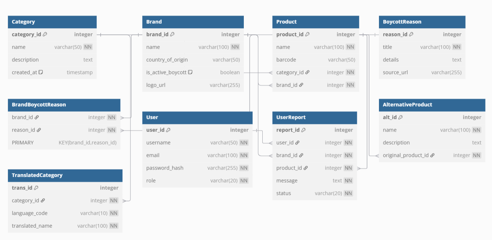

# 🚫BoycottIsraeliProducts
An app that contains all the occupation products
# Ethical Consumer Database System

**A robust SQL database solution for tracking boycotted brands and ethical alternatives**

## 📌 Project Overview
This database system empowers ethical consumption by tracking boycotted brands, their products, and alternative options. The schema demonstrates:
- Thoughtful normalization
- Comprehensive relationship mapping
- Scalable design for consumer activism applications

## 🏗️ Schema Design Highlights

### Core Entities
| Table | Key Features |
|-------|-------------|
| `Brand` | Tracks boycott status (`is_active_boycott`) with country of origin |
| `Product` | Links products to brands/categories with barcode support |
| `BoycottReason` | Documents boycott justifications with verifiable sources |
| `BrandBoycottReason` | Junction table for many-to-many brand/reason relationships |

### Supporting Structures
| Table | Purpose |
|-------|---------|
| `UserReport` | Crowdsourced boycott verification system |
| `AlternativeProduct` | Ethical substitutes database |
| `TranslatedCategory` | Multilingual category support |
